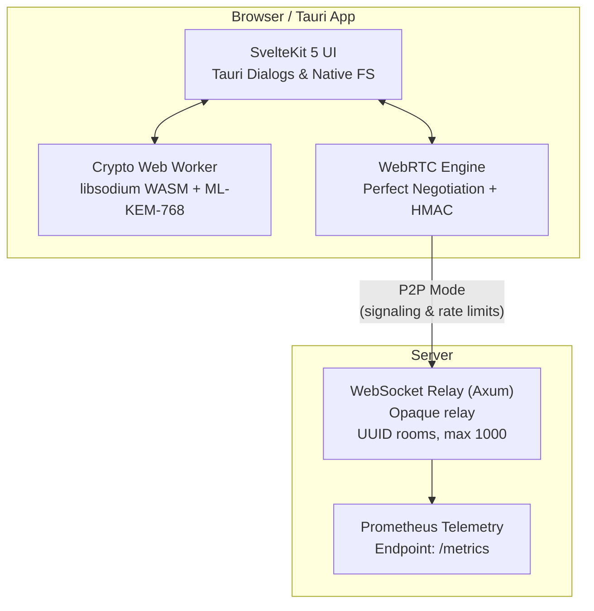

<h1 align="center">VoidDrop</h1>

<p align="center">
  <strong>End-to-end encrypted, zero-knowledge file sharing.</strong><br>
  Your files. Your keys. Absolute privacy.
</p>

<p align="center">
  <a href="#features">Features</a> •
  <a href="#security-model">Security Model</a> •
  <a href="#architecture">Architecture</a> •
  <a href="#protocol">Protocol</a> •
  <a href="#getting-started">Getting Started</a> •
  <a href="#self-hosting">Self-Hosting</a> •
  <a href="#license">License</a>
</p>

---

## What is VoidDrop?

VoidDrop is a file-sharing platform built on a single principle: **the server should know nothing about your data**. Files are encrypted entirely on the client side before they ever leave your browser. The encryption key exists only in the URL fragment (`#secret`), which is [never sent to the server](https://developer.mozilla.org/en-US/docs/Web/API/URL/hash) by design of the HTTP protocol. VoidDrop focuses entirely on direct, secure **Peer-to-Peer (P2P)** transfers for absolute privacy. All file transfers occur directly between the sender and receiver without any intermediary storage. The server functions exclusively as a transient WebRTC signaling channel and retains zero knowledge of the keys, file names, or contents.

---

## Features

- 🔐 **End-to-End Encryption** — XChaCha20-Poly1305 via libsodium. Keys never leave the client.
- 🛡️ **Post-Quantum Key Exchange** — Hybrid KEM: ML-KEM-768 (Kyber) + X25519 for P2P sessions.
- 🌐 **Peer-to-Peer Transfer** — Dual WebRTC DataChannels (control + data) with Perfect Negotiation pattern.
- 📱 **Native Desktop App (Tauri)** — Native client is fully integrated, bypassing standard browser size/memory limits with native directory selection.
- 📦 **Bundle & Folder Support** — Send entire directories. The receiver gets a file tree preview and can selectively download individual files. Supports isolated directory creation to avoid collisions, and iOS-safe in-memory ZIP package download (`JSZip`) for legacy platforms.
- 📡 **HMAC-Authenticated Signaling** — WebRTC signaling messages are CBOR-encoded and HMAC-SHA-256 signed with the PSK. The server relays opaque blobs and cannot inject or modify SDP offers.
- 🧮 **Streaming Crypto** — Files are encrypted/decrypted in a Web Worker using a custom-framed counter-based stream cipher (XChaCha20-Poly1305) via Rust-compiled WebAssembly (`crypto-worker` module) — constant memory usage regardless of file size.
- 🆔 **Anonymous Identity** — Ephemeral Ed25519 keypair generated in the browser per session and stored in session storage. No accounts, no emails, no passwords. Used for secure client-side cryptographic session isolation and prepared for handshake signatures.
- 🔢 **Monotonic Sequence Protection** — WebRTC signaling messages track sequence numbers (`seq`) per peer connection. The client discards any out-of-order or duplicated signals, preventing transaction replay attacks.
- 🧹 **Strict Memory Hygiene** — All session keys, temporary key exchange secrets, and intermediate state nonces are scrubbed using `sodium.memzero()` immediately upon session termination, preventing key-extraction from browser RAM.
- 🎲 **Cryptographically Secure Nonces** — In-transit manifest encryption generates randomized 24-byte nonces via `crypto.getRandomValues()` instead of fixed zero-nonces, eliminating key-stream reuse vulnerabilities.
- 📊 **Zero-Knowledge Metrics Telemetry** — Lightweight Prometheus `/metrics` endpoint in the Axum backend to track concurrent rooms, active WebSocket connections, rate limits, and network throughput without capturing personal user data.

---

## Security Model

### What the Server Never Sees

| Information | Server Access |
|---|---|
| File contents | ❌ Never (encrypted client-side) |
| File names / metadata | ❌ Never (encrypted in manifest) |
| Decryption key | ❌ Never (URL `#fragment` is not sent to server) |
| Who uploaded | ❌ Ephemeral Ed25519 pubkey, scrubbed from memory after session close |
| Who downloaded | ❌ No authentication required for download |
| P2P file data | ❌ Never touches the server |
| Signaling content | ❌ CBOR + HMAC-signed (server relays opaque blobs) |

### What the Server Does Know

| Information | Why |
|---|---|
| IP addresses | Inherent in TCP connections (use Tor/VPN to mitigate) |

### Threat Model & Verification

VoidDrop is designed to protect against:

- ✅ **Compromised server** — A malicious server operator learns nothing about your files
- ✅ **Network eavesdropping** — TLS + E2EE double encryption
- ✅ **Quantum adversaries** — Hybrid ML-KEM-768 + X25519 key exchange
- ✅ **Signaling MITM** — HMAC-SHA-256 authenticated signaling prevents SDP injection
- ✅ **Replay attacks** — WebRTC handshake binding & monotonic sequence verification
- ✅ **Memory extraction** — Automatic `sodium.memzero()` memory scrubbing on session cleanup

> [!NOTE]
> The security posture of VoidDrop is fully cataloged using the STRIDE threat modeling framework in [threat_model.md](docs/threat_model.md).
>
> In addition, the P2P signaling protocol has been formally verified using **ProVerif** via Applied Pi-Calculus. The formal specification is located at [voiddrop.pv](docs/verification/voiddrop.pv).

---

## Architecture



---

## Protocol

VoidDrop uses a custom binary container format specified in [Protocol v1](docs/protocol_v1_spec.md).

### Key Derivation

The **PSK** is always extracted from the URL fragment (`#<hex>`). It never leaves the browser.

All data and signaling keys are derived using HKDF-SHA-256:

```
PSK (32 bytes, from URL fragment — never sent to server)
  │
  ├── HKDF-SHA-256(PSK, "signaling-mac") → k_hmac (Signaling HMAC integrity)
  │
  └── Mixed with SharedSecret (ML-KEM-768 + X25519 hybrid exchange)
        │
        ├── HKDF-SHA-256(PSK || SharedSecret, "manifest")     → k_manifest
        └── HKDF-SHA-256(PSK || SharedSecret, "p2p-seg-base") → k_stream
```

### Binary Container

| Section | Size | Contents |
|---|---|---|
| **Global Header** | 26 bytes | Magic (`VDDP01`), version, cipher suite, segment size, manifest length |
| **Encrypted Manifest** | Variable | XChaCha20-Poly1305 sealed CBOR: file names, sizes, bundle structure. AAD = Global Header. Includes prepended random 24-byte nonce. |
| **Data Stream** | Variable | Custom framed stream cipher: 32KB frames, length-prefixed, AEAD per frame, `TAG_FINAL` on last |

### Cryptographic Primitives

| Purpose | Algorithm | Implementation |
|---|---|---|
| Manifest encryption | XChaCha20-Poly1305 (AEAD) | Rust WASM (crypto-worker) with randomized nonces |
| Stream encryption | Custom framed stream cipher (XChaCha20-Poly1305) | Rust WASM (crypto-worker) |
| Key derivation | HKDF-SHA-256 | WebCrypto API |
| Signaling MAC | HMAC-SHA-256 | WebCrypto API |
| Key exchange (P2P) | X25519 + ML-KEM-768 | libsodium + custom WASM |
| Upload signing | Ed25519 | WebCrypto API |
| Signaling encoding | CBOR | cbor-x |
| Memory Scrubbing | libsodium memzero | libsodium-wrappers |

---

## Tech Stack

### Frontend / Desktop Client
- **Framework**: SvelteKit 5 + TypeScript (using Svelte 5 Native `$state` Class properties)
- **Desktop Wrapper**: Tauri 2 (bypasses browser memory limits, native file selection)
- **Crypto**: libsodium-wrappers (WASM) + custom ML-KEM-768 WASM module
- **P2P**: Native WebRTC API with Perfect Negotiation and Sequence Tracking
- **ZIP Packaging**: JSZip (high-performance fallback for iOS and folder downloads)
- **Bundler**: Vite

### Backend (Pure Signaling Relay)
- **Language**: Rust
- **Framework**: Axum (WebSocket-only relay `/ws/{room_id}`)
- **Rate Limiting**: DashMap (lock-free concurrent token bucket grouped by IP/Subnet with TOCTOU protection)
- **Logging**: Migrated to `tracing` (structured diagnostic logging)
- **Telemetry**: Integrated Prometheus `/metrics` collector endpoint
- **Auth**: HMAC-SHA-256 for signaling authentication, Ed25519 signature verification

### Infrastructure
- **STUN**: Google public STUN servers
- **TURN**: Coturn (Exposed on dedicated subdomain `turn.your-domain.com` for VPN/symmetric NAT traversal)
- **Reverse Proxy**: Caddy (Strict Content Security Policy without `unsafe-inline` via nonce hashes)
- **Containerization**: Docker Compose

---

## Getting Started

### Prerequisites

- [Docker](https://docs.docker.com/get-docker/) & Docker Compose
- [Rust](https://rustup.rs/) (stable)
- [Node.js](https://nodejs.org/) ≥ 20
- [wasm-pack](https://rustwasm.github.io/wasm-pack/) (for PQC WASM module)

### 1. Start Infrastructure

```bash
docker compose up -d
```

This starts the Coturn TURN server and Caddy reverse proxy.

### 2. Build the PQC WASM Module

```bash
cd crypto-worker
wasm-pack build --target web
```

### 3. Start the Backend

```bash
cd backend
cargo run
```

The backend runs a lightweight, high-performance WebSocket relay server on `http://localhost:3300` (or falls back to `3301` if WSAEACCES port exclusion occurs on Windows). It also serves Prometheus telemetry metrics on `/metrics`.

### 4. Start the Frontend

```bash
cd frontend
cp .env.example .env   # set PUBLIC_API_BASE
npm install
npm run dev
```

Starts on `http://localhost:5173`.

---

## Self-Hosting

VoidDrop is designed to be self-hosted. The server is intentionally "blind" — even a malicious host cannot access your files.

### Environment Variables

#### Backend (`backend/.env`)
```env
# CORS origins (comma-separated)
CORS_ORIGINS=https://your-domain.com,http://localhost:5173

# Maximum concurrent rooms (default: 1000)
MAX_ROOMS=1000
```

#### Frontend (`frontend/.env`)
```env
PUBLIC_API_BASE=https://api.your-domain.com

# Optional: TURN server for NAT traversal
PUBLIC_TURN_URL=turn:your-server:3478
PUBLIC_TURN_USERNAME=turnuser
PUBLIC_TURN_CREDENTIAL=your-turn-password
```

### Production Deployment

1. Point your domain DNS to your server
2. Configure TLS (Caddy handles this automatically)
3. Set `CORS_ORIGINS` and `MAX_ROOMS` in `backend/.env`
4. Update `PUBLIC_API_BASE` in `frontend/.env`
5. Build the frontend: `npm run build`
6. Run the backend: `cargo run --release`

---

## Project Structure

```
VoidDrop/
├── backend/                     # Rust WebSocket relay
│   └── src/
│       ├── main.rs              # App state, room GC, router, port fallback, Prometheus telemetry metrics
│       ├── middleware.rs         # Rate limiting (token bucket per IP)
│       ├── tests.rs              # 19 backend integration tests (CORS, Rate limits, GC)
│       └── handlers/
│           ├── ws.rs             # WebSocket signaling relay
│           └── turn.rs           # Dynamic TURN credentials generator with tracing logs
├── frontend/                    # SvelteKit web & Tauri application
│   ├── src-tauri/               # Tauri native desktop integration
│   └── src/
│       ├── hooks.server.ts       # Security headers (Strict Content Security Policy)
│       ├── lib/
│       │   ├── components/       # Reusable modular UI components
│       │   │   ├── TitleBar.svelte       # App header window controls
│       │   │   ├── ThemeToggle.svelte    # Light/Dark mode switcher
│       │   │   ├── SenderView.svelte     # File dropping & transmission dashboard
│       │   │   ├── ReceiverView.svelte   # Room selection & download console
│       │   │   ├── DropZone.svelte       # Drag and drop overlay
│       │   │   ├── SpecModal.svelte      # Detailed crypto specs and diagnostic logs
│       │   │   ├── LayoutErrorBoundary.svelte # Svelte 5 global crash handler
│       │   │   ├── FileExplorer.svelte    # Unified file tree list (sender + receiver)
│       │   │   ├── ConnectionLog.svelte   # Transfer logs + progress tracking
│       │   │   ├── ManifestPreview.svelte  # File preview before downloading
│       │   │   ├── QrCode.svelte          # P2P session QR generation
│       │   │   └── TransferDashboard.svelte # Interactive stats overlay & transfer summary
│       │   ├── transfer/         # Transfer engine modules
│       │   │   ├── transferState.svelte.ts # Native Svelte 5 State Class ($state)
│       │   │   ├── senderEngine.ts         # File chunking, P2P channels init
│       │   │   ├── receiverEngine.ts       # File writing, stream slicing, ZIP packager
│       │   │   └── cryptoOrchestrator.ts   # Worker messages & signaling broker
│       │   ├── worker/           # Crypto Web Worker (libsodium + ML-KEM WASM)
│       │   │   ├── crypto.worker.ts        # Background thread encrypting/decrypting data
│       │   │   └── service-worker.ts       # Offline PWA TypeScript service worker
│       │   ├── network/          # WebRTC P2P engine with sequence checking
│       │   ├── i18n.svelte.ts    # Minimal localization dictionary wrapper
│       │   ├── identity.ts       # Ed25519 ephemeral identity keys
│       │   ├── isTauri.ts        # Desktop environment detector
│       │   ├── tauriFs.ts        # Native recursive directory traversing
│       │   └── fileTree.ts       # File/directory tree parser & central junk-file filter
│       └── routes/
│           └── +page.svelte      # Main application entry point (decomposed)
├── crypto-worker/               # ML-KEM-768 WASM module (Rust)
├── docs/                        # Project specifications & threat models
│   ├── protocol_v1_spec.md      # VoidDrop Protocol v1 specification
│   ├── threat_model.md          # Comprehensive STRIDE threat model
│   ├── verification/
│   │   └── voiddrop.pv         # Applied Pi-Calculus ProVerif formal model
│   └── fix_docker.ps1           # Windows docker network Coturn workaround
├── docker-compose.yml           # Pure Coturn & Caddy services (no Postgres/MinIO dependencies)
└── Caddyfile                    # Reverse proxy config
```

---

## Security Hardening

| Protection | Implementation |
|---|---|---|
| WebSocket limits | Messages > 256 KB → immediate disconnect (hardened in E2E tests) |
| Room ID validation | UUID format required, max 1,000 concurrent rooms |
| Rate limiting | Token bucket per IP via lock-free DashMap, IPv6 grouped by /64 prefix |
| Error sanitization | Internal errors logged server-side via `tracing`, generic messages to client |
| Truncation detection | `TAG_FINAL` validation on last stream chunk |
| Security headers | CSP (no `unsafe-inline`), X-Frame-Options DENY, no-referrer, nosniff, Permissions-Policy |
| Ephemeral Rooms | Automatic garbage collector prunes empty rooms every 5 minutes |
| Screen Wake Lock | Prevents mobile OS from killing transfers when screen turns off |
| Isolated Folders | Isolated directory creation prevents local file overwrites |
| Thread-Safety | TOCTOU check-and-insert race conditions resolved in AppState |

---

## Testing

### Frontend Unit & Integration (Vitest)

```bash
cd frontend
npx vitest run
```

**197 tests** across 16 test files:

| Test Suite | Tests | Coverage |
|---|---|---|
| `crypto.test.ts` | 15 | Crypto roundtrips, key derivation, AAD binding, TAG_FINAL, tampered data |
| `manifest.test.ts` | 19 | Manifest CBOR encoding/decoding, zero-byte files, Unicode, large bundles |
| `e2e-crypto.test.ts` | 10 | Full encrypt→decrypt pipeline: single files, bundles, wrong keys, 1MB integrity |
| `fileTree.test.ts` | 30 | File tree building, filtering, sorting, manifest builder, size estimation |
| `senderEngine.test.ts` | 13 | File chunking with batching, zero-byte files, data integrity |
| `receiverEngine.test.ts` | 19 | Chunk slicing across file boundaries, write queue, re-entrancy protection |
| `webrtc.test.ts` | 27 | Frame protocol, Global Header format, ICE/TURN fallback, WS URL derivation, Signal Sequence tracking |
| `webrtc-hmac.test.ts` | 7 | HMAC sign/verify, tamper detection, key isolation |
| `psk.test.ts` | 15 | PSK hex parsing and validation |
| `stream-deframing.test.ts` | 12 | Frame splitting, buffering, retry |
| `identity.test.ts` | 3 | Ed25519 keypair generation, payload signing |
| `isTauri.test.ts` | 3 | Checks Tauri desktop environment flags |
| `QrCode.test.ts` | 3 | Validates QR code generation and link binding |
| `originTranslation.test.ts` | 5 | Verifies window location and origin translation helpers |
| `localDiscovery.test.ts` | 7 | Verifies local LAN peer multicast discovery |
| `tauriFs.test.ts` | 9 | Tests Tauri native filesystem writing bridge |

### Backend Integration Tests (Cargo)

```bash
cd backend
cargo test
```

**19 integration tests** covering:
- Room allocation & duplicate request handling
- Atomic DashMap rate limiting (token bucket depletion & IP grouping)
- WebSocket route protection & invalid Room ID/UUID format validation
- Prometheus `/metrics` payload formatting
- CORS preflight validation & IP extraction from trust proxies

### End-to-End P2P Tests (Playwright)

```bash
cd frontend
npx playwright test
```

**14 E2E tests** covering full end-to-end P2P file transfers:
- Basic single file transmission
- Large files transmission (> 256KB limits verification)
- Multiple receivers simultaneous download flow
- Folder transfer with tree building and metadata assembly
- Network/WebRTC offline fallback behavior
- Rate limiting bucket exhaustion (dynamic TURN credentials token buckets)
- Ephemeral rooms pruning and history capping limits

---

## Roadmap

- [x] E2EE with XChaCha20-Poly1305 secretstream
- [x] WebRTC P2P with Perfect Negotiation
- [x] Post-Quantum hybrid KEM (ML-KEM-768 + X25519)
- [x] Bundle & Directory support (recursive traversing with selective extraction)
- [x] Isolated directory receiver folders (prevents name collisions)
- [x] High-performance ZIP fallback download (iOS/mobile and folder downloads)
- [x] HMAC-authenticated signaling relay
- [x] Backend security hardening & concurrent Token Bucket rate limiter
- [x] Security headers (Strict Content Security Policy without `unsafe-inline`)
- [x] IPv6 rate limiter grouping (bucket per /64 prefix, not per address)
- [x] CORS origins from environment variable (no recompile for self-hosters)
- [x] Screen Wake Lock API (prevent mobile sleep during long transfers)
- [x] TURN relay deployment (Coturn for symmetric NAT and VPN traversal)
- [x] Tauri desktop app (bypasses browser memory limits, native file selection)
- [x] Svelte 5 Native state class `$state` refactoring
- [x] God Components decomposition (UI cleanup and encapsulation)
- [x] Monotonic Sequence Tracking on signals
- [x] libsodium cryptographically secure memory scrubbing (`sodium.memzero`)
- [x] Prometheus Metrics Telemetry Integration
- [x] Playwright P2P E2E Integration Suite
- [x] Resumable P2P transfer (per-segment key derivation in protocol v2)
- [ ] CLI client for headless environments

---

## Contributing

Contributions are welcome. Please open an issue before submitting a PR for significant changes.

Core principle: **the server must remain blind**. Any change that gives the server access to plaintext data, file metadata, or user identity will be rejected.

---

## License

This project is licensed under the [MIT License](LICENSE).

---

<p align="center">
  <sub>Built with paranoia. Trust no server — not even this one.</sub>
</p>
