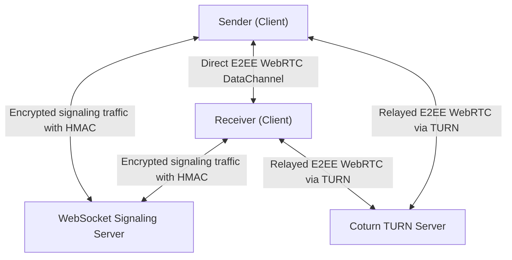

# VoidDrop Protocol Security Threat Model

## 1. Introduction and Protocol Architecture
VoidDrop is an end-to-end encrypted (E2EE) protocol designed for secure and confidential peer-to-peer (P2P) transmission of files and directories within web browsers and desktop environments.

The architecture is built on a "zero-trust" signaling relay philosophy. All actual data transmission occurs directly between the Sender and the Receiver via WebRTC DataChannels. The transient, intermediary WebSocket signaling server is utilized strictly for participant discovery and relaying encrypted signal blobs (SDP offers, answers, and ICE candidates). A TURN server (e.g., Coturn) is engaged for media/data relay only when strict NAT or firewall rules prevent direct connection establishment between clients.



## 2. Trust Boundaries and Attacker Assumptions
### Security Assertions (Cryptographic Baseline):
1. **URL Hash Fragment**: The URL hash fragment (`#<secret>`) is strictly private to the client side. Web browsers never transmit the fragment identifier (anything after the `#`) to the host server in HTTP request headers. Consequently, the root pre-shared key (`PSK`) remains exclusive to the sender and the receiver who navigates to the full link.
2. **Attacker Model (Adversarial Capabilities)**:
   - **Passive Network Eavesdropper**: Capable of capturing and inspecting network traffic routed between clients, the signaling relay, and the TURN server.
   - **Active Man-in-the-Middle (MitM) Attacker**: Capable of intercepting, modifying, deleting, or injecting arbitrary messages into signaling and data channels.
   - **Compromised Signaling/TURN Infrastructure**: The WebSocket signaling server or the TURN server is assumed to be fully controlled by a malicious adversary. The server may attempt to inject fraudulent SDP handshakes or intercept encryption keys.

---

## 3. STRIDE Threat Modeling

### 3.1. Spoofing (Identity Spoofing)
* **Threat**: An attacker attempts to join a file-sharing room disguised as the legitimate receiver to intercept files.
* **Mitigations**:
  - Room identifiers (`room_uuid`) are generated as cryptographically strong UUID v4 strings, preventing enumeration and brute-force discovery.
  - Every signaling message is authenticated with an `HMAC-SHA-256` signature tag generated using the signaling MAC key `k_sig_mac`. This key is derived directly from the `PSK` (contained in the URL fragment):
    $$k_{sig\_mac} = \text{HKDF-Expand}(\text{HKDF-Extract}(\emptyset, PSK), \text{"signaling-mac"}, 32)$$
  - Without knowledge of the URL's `PSK`, an adversary cannot generate a valid HMAC signature tag. The signaling server and the legitimate peers will instantly discard unauthenticated or improperly signed signaling messages.

### 3.2. Tampering (Data Modification)
* **Threat**: An active MitM agent or a compromised signaling server tampers with SDP parameters (e.g., swapping out public keys for X25519 or ML-KEM) to mount a key-exchange interception attack.
* **Mitigations**:
  - All signaling payloads are serialized using Canonical CBOR and signed with `HMAC-SHA-256` over the key `k_sig_mac`. Any bitwise modification of the SDP strings or ICE candidates renders the signature tag invalid.
  - The shared files are encrypted using keys derived from the hybrid key-exchange. Even if the attacker completely controls the transport-layer routing of WebRTC, they cannot decrypt or alter the data frames without triggering a decryption authentication failure (Poly1305 AEAD).

### 3.3. Repudiation (Repudiation of Transfer Actions)
* **Threat**: A sender falsely denies transmitting a specific payload, or a receiver claims that a file was modified or corrupted in-transit.
* **Mitigations**:
  - Secure local logging on client endpoints records the successful termination of the peer-to-peer session, cross-referencing integrity with the final file digest.
  - Monotonically increasing sequence counters (`seq`) are embedded in each peer's signaling messages. The client discards out-of-order or duplicate sequence numbers, completely eliminating signaling transaction replay attacks.

### 3.4. Information Disclosure (Confidentiality Leaks)
* **Threat**: Exposure of directory tree structures, file metadata (names, sizes, MIME types), or raw file payloads to unauthorized third parties or a malicious server operator.
* **Mitigations**:
  - **Metadata Encryption (Manifest)**: The file roster, structural directories, file sizes, and MIME types are serialized into a `Manifest` structure and sealed using `AEAD_XChaCha20_Poly1305` under the key `k_manifest`, which is derived from the hybrid key exchange and `PSK`.
  - **Payload Encryption**: The file body is fragmented into segments and frames, which are then encrypted using a custom-framed `XChaCha20-Poly1305` stream cipher under the segment key `k_seg_base`.
  - Eavesdroppers only observe high-entropy binary UDP packets crossing the WebRTC connection.

### 3.5. Denial of Service (Service Exhaustion)
* **Threat**: An attacker attempts to crash the signaling relay or exhaust server memory by spawning infinite room directories, broadcasting huge payloads, or keeping thousands of dead connections alive.
* **Mitigations**:
  - **Fixed History Buffer**: Signaling room message buffers are capped using a fixed-capacity FIFO collection (`VecDeque` with a limit of 100 entries). Older signaling messages are discarded under high volume, protecting server RAM from memory-exhaustion attacks.
  - **Instant Room Pruning**: The server instantly deallocates a room and purges its structures from RAM the moment the last active WebSocket client disconnects.
  - **Payload Constraints**: The Axum server strictly rejects WebSocket frames exceeding 256 KiB.
  - **Rate Limiting**: A concurrent lock-free Token Bucket rate limiter (grouped by IP/subnet) throttles connection requests and TURN credential queries.

### 3.6. Elevation of Privilege (Privilege Escalation)
* **Threat**: An unauthenticated user attempts to hijack administrative functions of the TURN infrastructure, or abuses the TURN server as an open relay proxy to scan internal target networks.
* **Mitigations**:
  - **Dynamic Time-Locked TURN Credentials**: Clients request short-lived, transient TURN credentials from the Axum API endpoint `/api/turn-credentials?room_id=<uuid>`. Credentials are dynamically generated using the standard REST API TURN algorithm keyed with `TURN_SHARED_SECRET`.
  - The generated TURN username encodes an absolute expiration timestamp (e.g., `timestamp:username`). The TURN server verifies the HMAC signature on the password and rejects authentications that have exceeded the validity window (2 hours). This halts replay vectors and unauthorized resource theft.
  - TURN credential generation is restricted strictly to active signaling rooms. Requests without a valid `room_id` (400 Bad Request) or referencing dead/non-existent rooms (403 Forbidden) are instantly blocked.

---

## 4. Post-Quantum Hybrid Key Encapsulation Mechanism (KEM) Analysis

VoidDrop implements modern forward secrecy (Forward Secrecy) designed to protect data against retrospective decryption strategies ("store-now, decrypt-later") by quantum computers:
1. **X25519**: A standard ECDH exchange over Montgomery curve 25519, establishing trusted classical security boundaries.
2. **ML-KEM-768**: A post-quantum key encapsulation mechanism conforming to the FIPS 203 standard, providing robust protection against future quantum attacks.

### Key Derivation Pipeline:
```text
PSK (URL Hash) ──────────────────────┐
                                     ▼
ML-KEM-768 Shared ──┐            ┌───────┐
                    ├───► IKM ──►│ HKDF  │──► k_manifest (Manifest Encryption)
X25519 Shared ──────┘            │Extract│──► k_seg_base (Segment Encryption)
                                 └───────┘
```

The final pre-master secret (`SharedSecret`) is composed of the concatenated shared outputs of both algorithms. The root data encryption keys are extracted via `HKDF-Extract` and `HKDF-Expand` using a salt derived from the hash of the context identifier `"voiddrop-v1"`.

---

## 5. Stream Encryption and Active Network Attack Mitigations

When broadcasting large data structures over unreliable P2P connections, robust controls are required to prevent payload truncation or frame-reordering attacks.

### 5.1. Nonce Uniqueness (Nonce Construction)
To avoid key-stream reuse vulnerabilities (a catastrophic failure mode for stream ciphers in the ChaCha family), each data frame is sealed with a unique 24-byte nonce:
* Upon session initiation, a cryptographically secure random 24-byte `nonce_base` is generated.
* The final 8 bytes of the `nonce_base` are overwritten with a 64-bit monotonic frame counter $c$ (encoded in Little-Endian):
  $$\text{nonce}[16..23] = c$$
* This guarantees absolute nonce uniqueness across all transmitted frames in a single session, protecting transfers up to $2^{64}$ frames (zettabytes of data).

### 5.2. Truncation Attack Mitigation
* Every plaintext data block is appended with a 1-byte message tag (`Tag`) prior to AEAD packaging.
* Normal progressive frames are marked with `TAG_MESSAGE = 0x01`.
* The final frame of the entire stream is explicitly marked with `TAG_FINAL = 0x02`.
* Upon decryption, the receiver is **required** to verify that the last successfully decrypted frame carries `TAG_FINAL`. If the WebRTC connection drops or the stream terminates before receiving a frame with `TAG_FINAL`, the entire transfer is rejected, written segments are securely wiped from client storage, and the payload is flagged as untrusted. This neutralizes attacks where an adversary forces connection termination to make a receiver accept an incomplete or truncated file payload.

---

## 6. Threat Mitigation Matrix

| Target Component / Threat | Attack Description | Risk Level | Implemented Mitigation Controls |
| :--- | :--- | :--- | :--- |
| **Signaling Relay (MitM)** | Intercept SDP/ICE payloads and inject fake public keys to decrypt P2P traffic. | **Low** (Cryptographically Protected) | `HMAC-SHA-256` signature validation on all signaling messages using a key tied directly to the URL `PSK`. |
| **Signaling Relay (DDoS)** | Exhaust server memory by flooding WebSocket handshakes or hoarding dead rooms. | **Medium** | Instant Room Pruning + History Capping (100 messages) + 256KB WS frame limits + Token Bucket Rate Limiting. |
| **TURN Infrastructure (Abuse)** | Leverage the TURN relay for anonymous port scanning or unauthorized traffic forwarding. | **High** | Transient REST API TURN credentials with strict time-to-live restrictions (2 hours) tied to active signaling rooms. |
| **Network Eavesdropper (Future)** | Capture encrypted WebRTC payloads and decrypt them using quantum compute in the future. | **Medium** | Post-Quantum hybrid `ML-KEM-768` + `X25519` key exchange protocol. |
| **Active Saboteur (Truncation)** | Artificially terminate WebRTC channels to trick receivers into executing an incomplete, truncated file. | **High** | Strict frame tag sequence validation requiring the explicit `TAG_FINAL (0x02)` marker in the closing frame. |

---

## 7. Recommendations for Future Security Hardening
1. **HTTP Strict Transport Security (HSTS)**: Enforce strict HSTS configurations on the hosting domain of the VoidDrop client application to permanently prevent protocol downgrades to unencrypted HTTP.
2. **Strict Content Security Policy (CSP)**: Maintain a highly restrictive CSP header policy. Restrict WebSocket connections (`connect-src`) strictly to verified signaling relays and prohibit `'unsafe-inline'` script executions to completely eliminate XSS vulnerabilities that could extract the `PSK` from the URL fragment.
3. **Continuous WASM Security Audits**: Periodically audit Rust package dependencies for the `crypto-worker` compilation target, and run static analysis on the compiled WASM binary to verify the absence of memory leaks and unscrubbed memory leaks.
